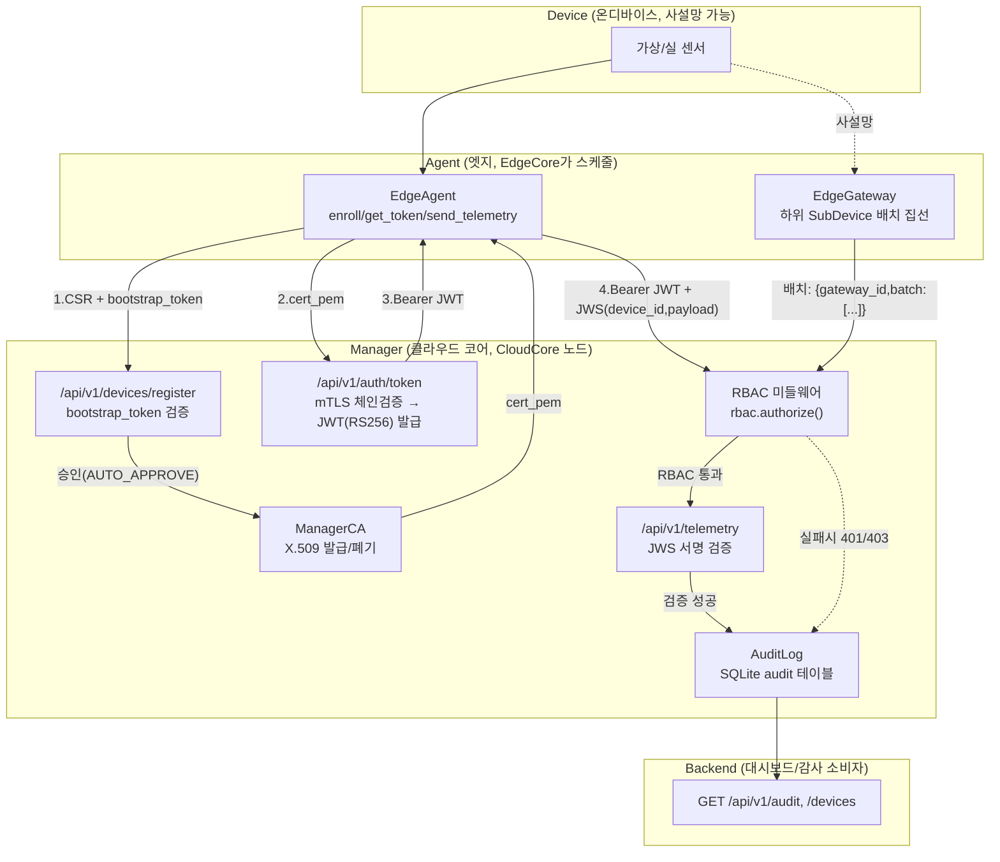

# 05. KubeEdge CloudCore–EdgeCore 연동 구조 및 4계층 보안 흐름

**수행항목 4(KubeEdge 연동 구조 적용)** 대응 문서.

## 1. KubeEdge CloudCore–EdgeCore 구조 분석

`deploy/demo-setup-v2.sh`(1차년도 `demo-setup.sh` 개작본)가 실제로 구축하는 구성 기준.

| 컴포넌트 | 위치 | 역할 |
|---|---|---|
| **K3s API 서버** | cloud VM | Kubernetes 제어 평면(`--disable=traefik --disable=servicelb`로 경량화) |
| **CloudCore** | cloud VM (`keadm init`) | KubeEdge 클라우드측 데몬 — EdgeHub와의 WebSocket 터널 종단, K8s 리소스를 엣지로 동기화 |
| **EdgeCore** | edge1/edge2 VM (`keadm join --cloudcore-ipport=$CLOUD_IP:10000`) | 엣지측 데몬 — 내부에 **EdgeHub**(CloudHub와의 터널 클라이언트) · **MetaManager**(로컬 메타데이터 캐시/오프라인 지속성) · Edged(파드 실행)를 포함 |
| **metaServer / edgeStream** | edge1/edge2 `edgecore.yaml` | 데모 스크립트가 `metaServer.enable`과 `edgeStream.enable`을 `true`로 패치(§1 5단계) — 엣지 로컬 API 접근과 CloudCore↔EdgeCore 스트림 기능을 활성화 |

CloudHub(Cloud측)–EdgeHub(Edge측) 터널은 **K8s 리소스 동기화(제어 평면)** 전용으로 남겨두고, 본 보안 코어 모듈(Manager REST API)은 `docs/01-comm-method-decision.md`의 결론대로 이 터널과 **별도의 mTLS/JWT REST 채널**로 동작한다. Agent/Gateway 파드는 EdgeCore가 스케줄링·실행하지만, 이 파드들이 Manager와 주고받는 등록/인증/텔레메트리 트래픽은 CloudHub–EdgeHub 터널을 타지 않는다.

## 2. 4계층(Device–Agent–Manager–Backend) 보안 모듈 적용 흐름도

## 3. 등록~제어~데이터 전송 전체 프로세스

| 단계 | 주체 | 동작 | 근거 코드 |
|---|---|---|---|
| 1. 배치(제어) | KubeEdge | `k8s/agent-edge1.yaml`/`agent-edge2.yaml`/`gateway.yaml`의 `nodeSelector: node-role.kubernetes.io/edge`에 따라 EdgeCore가 Agent/Gateway 파드를 엣지 노드에 스케줄 | `deploy/demo-setup-v2.sh` 5단계(edge 라벨 부착) |
| 2. 등록(Registration) | Agent/Gateway → Manager | CSR 생성 + `bootstrap_token` 제출 → `AUTO_APPROVE=true`면 즉시 X.509 발급, 아니면 `pending` | `EdgeAgent.enroll()`, `app.py: register_device` |
| 3. 인증(Authentication) | Agent/Gateway → Manager | 발급받은 인증서로 `/auth/token` 호출 → 체인검증·폐기목록 대조 후 role=`device` Bearer JWT(RS256, TTL 900s) 발급 | `app.py: auth_token` |
| 4. 인가(Authorization) | Manager | `authenticated` 의존성이 매 요청마다 `rbac.authorize(role, method, path)`로 역할 검사 | `app.py`, `rbac.py` |
| 5. 데이터 전송(Data) | Agent/Gateway → Manager | 페이로드를 디바이스 개인키로 JWS 서명 후 Bearer JWT와 함께 `/telemetry` POST → Manager가 저장된 디바이스 인증서 공개키로 서명 검증 | `EdgeAgent.send_telemetry()`, `app.py: submit_telemetry` |
| 6. 감사(Accounting) | Manager | 모든 HTTP 요청 + AAA 이벤트(`register`/`auth_success`/`auth_fail`/`telemetry_accept`/`telemetry_reject`/`approve`/`revoke`)를 SQLite `audit` 테이블에 기록 | `AuditLog.record()`, `app.py` 미들웨어 |
| 7. 사설망 집선(선택) | Gateway | 사설 IP 하위 디바이스는 Manager에 직접 등록하지 않고 게이트웨이가 배치로 대신 업링크 | `src/eam/gateway/gateway.py` (상세: `docs/03-network-addressing.md`) |

## 4. 시연·영상 제공 계획

| 구분 | 방법 | 소요 |
|---|---|---|
| **로컬 데모(즉시 가능)** | `python demo/run_demo.py` (또는 `--fast`) — 클러스터 불필요, INSECURE_MODE 전/후 재기동으로 401 거부 vs 정상 흐름을 대조 후 감사로그 tail 출력 | 수 초~수십 초 |
| **K8s/KubeEdge 실환경 시연** | `deploy/demo-setup-v2.sh`로 Multipass 3-VM(cloud/edge1/edge2) 클러스터 구축 → `multipass exec cloud -- kubectl get pods -n edge-auth -o wide`로 4계층 확인 → `kubectl set env deployment/manager -n edge-auth INSECURE_MODE=true/false` + `rollout restart`로 전/후 전환 | 환경 구축 약 10분(스크립트 내 단계별 소요시간 주석 참고) |
| **영상 제공** | 위 두 시연을 화면 녹화해 촬영 포인트(`demo/DEMO_SCENARIO.md`의 진행 순서 표)를 그대로 나레이션 스크립트로 사용 — 별도 영상 편집 없이 콘솔 출력(한국어 내레이션 포함)을 그대로 녹화 가능 | 문서화 완료, 실제 촬영은 Task 8/발표 준비 단계에서 진행 |

## 5. 결론

- KubeEdge CloudCore–EdgeCore 표준 구조(EdgeHub/CloudHub/MetaManager)는 **제어 평면 그대로** 사용하고, 본 보안 코어 모듈은 그 위에 독립적인 REST+mTLS+JWT/JWS AAA 계층을 얹는 구조로 4계층(Device–Agent–Manager–Backend) 전체를 관통한다.
- 등록→인증→인가→데이터 전송→감사의 전 과정이 코드(`app.py`, `rbac.py`, `pki.py`, `jws.py`, `audit.py`)에 이미 구현·테스트(`tests/test_manager_api.py` 등)돼 있으며, 로컬 데모와 K8s 실환경 데모 두 경로 모두로 시연 가능하다.
