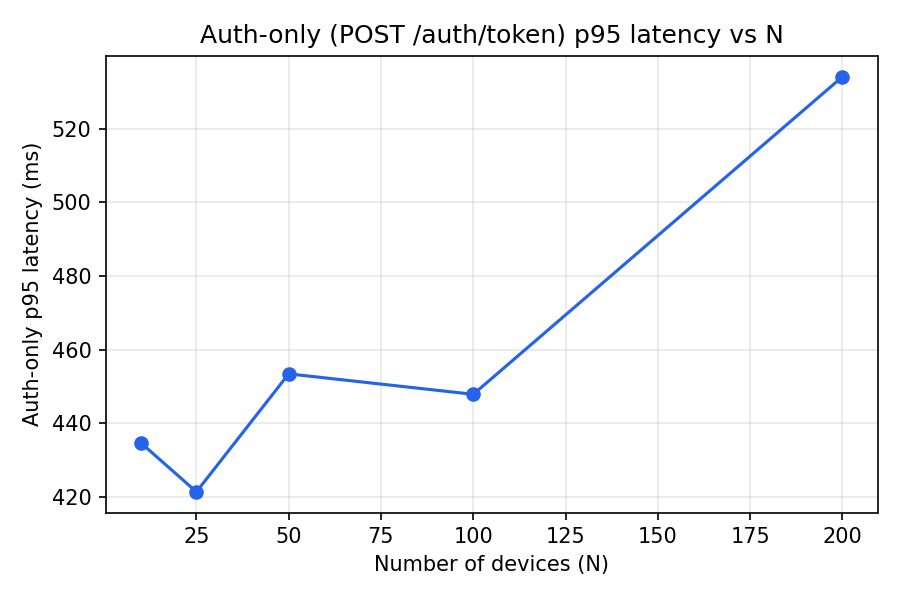
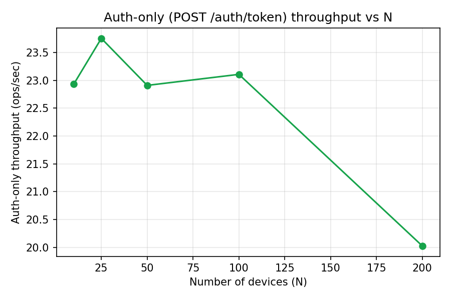

# 성능 벤치마크 리포트

- 실행 시각: 2026-08-04T01:15:22
- 측정 대상 N: 10, 25, 50, 100, 200 (클라이언트 동시성 concurrency=10, 디바이스당 텔레메트리 1회)
- 측정 환경: Python 3.10.0, CPU 코어 16개, Windows-10-10.0.26200-SP0
- 전체 스윕 소요 시간: 125.8s (in-process ASGI - 실네트워크/Docker 미사용)

## 1. N별 단계별 지연시간 (ms) - 전체 수명주기 (참고용)

enroll 단계에는 디바이스가 스스로 RSA-2048 키를 생성하는 현실적인 CPU 비용이 포함돼 있다(`EdgeAgent.enroll()`이 `asyncio.to_thread`로 오프로드해 이벤트 루프는 막지 않지만, 그 자체의 소요 시간은 여전히 존재). 이 표는 있는 그대로의 수명주기 체감 지연시간 참고용이며, **1,000기 외삽 모델의 μ 적합에는 사용하지 않는다**(§2·§4·§5 참고).

| N | 단계 | count | p50 | p95 | p99 | mean | max |
|---|---|---|---|---|---|---|---|
| 10 | enroll | 10 | 731.1 | 843.7 | 853.9 | 711.8 | 856.5 |
| 10 | auth | 10 | 586.4 | 700.8 | 710.4 | 584.8 | 712.8 |
| 10 | telemetry | 10 | 306.8 | 433.9 | 445.2 | 306.7 | 448.0 |
| 25 | enroll | 25 | 555.2 | 773.5 | 795.6 | 580.7 | 800.9 |
| 25 | auth | 25 | 529.5 | 699.8 | 712.3 | 515.5 | 714.4 |
| 25 | telemetry | 25 | 349.1 | 509.6 | 530.1 | 338.2 | 534.6 |
| 50 | enroll | 50 | 672.1 | 854.7 | 905.2 | 667.6 | 914.5 |
| 50 | auth | 50 | 593.6 | 716.5 | 742.6 | 593.8 | 752.3 |
| 50 | telemetry | 50 | 388.9 | 501.8 | 521.5 | 379.5 | 525.2 |
| 100 | enroll | 100 | 695.4 | 929.4 | 1003.5 | 691.6 | 1032.4 |
| 100 | auth | 100 | 576.7 | 711.2 | 730.7 | 581.9 | 732.9 |
| 100 | telemetry | 100 | 446.7 | 636.9 | 675.8 | 437.2 | 746.4 |
| 200 | enroll | 200 | 682.3 | 976.5 | 1050.2 | 701.9 | 1139.5 |
| 200 | auth | 200 | 630.0 | 781.3 | 810.3 | 630.4 | 833.3 |
| 200 | telemetry | 200 | 458.2 | 644.2 | 778.0 | 461.6 | 878.1 |

## 2. N별 인증 전용(auth-only) 버스트 - 외삽 모델의 기반 지표

**측정 방법**: N대를 먼저 enroll(인증서 발급, 측정 대상 아님)한 뒤, 이미 발급된 인증서로 `POST /auth/token`만 동시에 호출하는 별도 버스트를 실행한다(`bench/run_bench.py:_run_auth_only_storm`). 클라이언트 키 생성 비용이 전혀 섞이지 않으므로, 관측된 처리량은 Manager 단일 워커(단일 프로세스/단일 이벤트 루프)의 순수 인증 처리 용량(인증서 체인 검증 + RS256 JWT 서명, ASGI 오버헤드 포함)을 반영한다.

처리량 산식: `auth_only_ops_per_sec = N / auth-only 버스트 wall_time_s` (버스트 wall_time은 N개 `/auth/token` 호출이 모두 끝날 때까지의 시간 - 키 생성이 섞인 §1의 전체 수명주기 wall_time과는 다른 측정치).

| N | auth-only wall_time_s | auth-only p50 | auth-only p95 | auth-only ops/sec | (참고) 전체 수명주기 ops/sec |
|---|---|---|---|---|---|
| 10 | 0.436 | 434.5 | 434.7 | 22.94 | 5.68 |
| 25 | 1.052 | 408.8 | 421.4 | 23.76 | 5.64 |
| 50 | 2.182 | 435.5 | 453.4 | 22.91 | 5.63 |
| 100 | 4.327 | 436.3 | 447.9 | 23.11 | 5.56 |
| 200 | 9.987 | 506.9 | 534.1 | 20.03 | 5.27 |

참고 열(전체 수명주기 ops/sec)은 §5-①에서 설명하는 과거 버전의 근사치를 비교용으로 남긴 것으로, 외삽에는 쓰이지 않는다.

## 3. 차트 (auth-only 버스트 기준)

## 4. 1,000기 외삽 모델 결과

- 워커(프로세스) 1개당 실측 서비스율(μ) 추정치: **23.76 auth/s** (§2 auth-only 버스트 처리량 중 최댓값을 워커 1개 기준으로 나눔 - 클라이언트 키 생성 비용이 섞이지 않은, in-process 단일 워커 Manager의 순수 인증 처리 용량 + ASGI 오버헤드를 측정한 값. §5-① 참고)
- 시나리오: 1000대 디바이스가 60초 내 동시 재인증(포아송 도착 근사, M/M/c 대기행렬)
- 목표 SLA: 대기시간(Wq) p95 < 1.0초

### 4.1 단일 워커(c=1) 기준 예측

- 유틸라이제이션(ρ) = 0.70 (안정 여부: True)
- 평균 대기시간(Wq): 99.0 ms
- p95 대기시간: 372.6 ms
- p99 대기시간: 599.6 ms
- 최대 대기시간(근사, N개 중 최댓값): 924.4 ms
- 지속 가능 처리량: 23.76 auth/s

### 4.2 권장 레플리카 수 및 예측

- 목표 SLA(p95<1.0s) 충족 최소 레플리카 수: **1대**
- 해당 구성에서 평균 대기시간: 99.0 ms
- 해당 구성에서 p95 대기시간: 372.6 ms
- 해당 구성에서 최대 대기시간(근사): 924.4 ms
- 해당 구성에서 지속 가능 처리량: 23.76 auth/s

**병목 판단**: 단일 인스턴스로도 1,000기 동시 인증 스톰의 목표 SLA를 충족 가능.

### 4.3 다항 최소제곱 적합 (보조 검산)

M/M/c 외삽과 별개로, 실측 (N, auth-only 처리량) 포인트에 2차 다항식을 최소제곱으로 적합해 추세가 M/M/c의 포화 가정과 어긋나지 않는지 교차 확인합니다.

- 적합 계수(최고차항부터): [-0.000144, 0.014109, 22.998831]
- 측정 최대 N에서 다항식 예측 처리량: 20.04 auth/s
- N=1000 외삽 시 다항식 예측 처리량: -107.36 auth/s (참고용 - 다항 외삽은 N이 측정 범위를 크게 벗어나면 신뢰도가 낮아짐)

## 5. 한계 및 전제

① **(수정 이력) 과거 μ 추정치는 서버가 아니라 하네스 자신의 병목을 측정한 것이었음**: 이 리포트의 이전 버전은 μ를 "auth 단계 성공 횟수 / 플릿 전체 실행 wall_time_s"(전체 수명주기 wall-clock을 분모로 사용)로 추정했다. 그런데 당시 `EdgeAgent.enroll()`은 CSR/RSA-2048 키 생성을 이벤트 루프 위에서 **동기적으로** 수행했고, 이는 CPU-bound 작업이라 `asyncio.Semaphore(concurrency)`로 동시성을 열어줘도 실질적으로는 한 코루틴의 키 생성이 끝나야 다음 코루틴이 진행되는 사실상 직렬 실행이었다. 따라서 그 μ 상한은 "Manager의 인증 처리 용량"이 아니라 "벤치마크 하네스 자신의 (사실상 직렬화된) 클라이언트 키 생성 속도"를 측정한 것이었고, 여기서 도출된 "레플리카 4대" 같은 서버 확장 권고는 클라이언트 측 아티팩트에 대한 처방이었다는 점에서 부정확했다. 이번 수정으로 (a) `EdgeAgent.enroll()`의 키 생성을 `asyncio.to_thread`로 오프로드해 이벤트 루프를 막지 않게 하고(현실적으로도 타당함 - 실제 디바이스들은 각자 독립적으로/병렬로 키를 생성하지, 하나의 루프 뒤에서 직렬화되지 않는다), (b) μ 적합 대상을 §2의 인증 전용(auth-only) 버스트 처리량으로 분리했다. **현재 μ(§4)는 이미 인증서가 발급된 디바이스들이 동시에 `POST /auth/token`만 호출할 때의 in-process 단일 워커(단일 프로세스) Manager의 순수 인증 처리 용량 - 인증서 체인 검증 + RS256 JWT 서명 연산 + ASGI 오버헤드를 포함하되 클라이언트 키 생성/실네트워크/uvicorn 다중 워커 오버헤드는 제외 - 을 측정한다.**
② **레플리카 확장 권고의 전제**: §4.2의 "N대 레플리카로 확장" 논리는 ①에서 측정한 서버 측(§2 auth-only) 병목에 대한 처방이며, 클라이언트(각 디바이스)의 키 생성은 서버와 독립적으로 병렬 수행된다고 가정한다(실제로 디바이스마다 별도의 CPU/코어를 갖는 임베디드 환경에서는 합리적인 가정). 만약 클라이언트 키 생성이 여전히 병목이라면(예: 저사양 임베디드 디바이스) 레플리카 확장만으로는 체감 지연시간이 개선되지 않는다 - 이 경우 §1의 전체 수명주기 enroll 지연시간을 별도로 참고해야 한다.
③ **벤치마크 환경**: 실제 uvicorn 다중 워커/네트워크가 아닌 단일 프로세스 in-process ASGI(`httpx.ASGITransport`)로 측정 - 실네트워크 지연/컨테이너 오버헤드는 반영되지 않음.
④ **M/M/c 가정**: 도착은 포아송 과정, 서비스시간은 지수분포라고 근사. 실제 정전 복구 등 인증 스톰은 도착이 더 뭉칠 수 있어(버스트) 실제 대기시간이 모델 예측보다 클 수 있음.
⑤ **선형 확장 가정**: c개 레플리카로 확장 시 총 서비스율이 c*μ로 선형 증가한다고 가정 - 실제로는 공유 DB(SQLite)/락 경합으로 선형보다 낮을 수 있음(SQLite는 다중 프로세스 동시 쓰기에 제약이 있어 운영 환경에서는 레플리카별 DB 분리 또는 다른 저장소로의 전환이 별도로 검토돼야 함).
⑥ **최대 대기시간 근사**: 이론적 상한이 아니라 N개 표본 중 최댓값을 `(1 - 1/N)` 분위수로 근사한 값.
⑦ **numpy 사용 고지**: 이 프로젝트의 허용 패키지 목록에는 numpy가 명시돼 있지 않지만, matplotlib의 필수 의존성으로 이미 설치돼 있어 다항 최소제곱 적합에서만 제한적으로 사용함(`bench/model.py` 참고).
